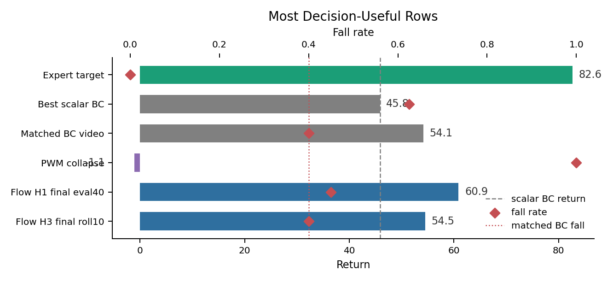
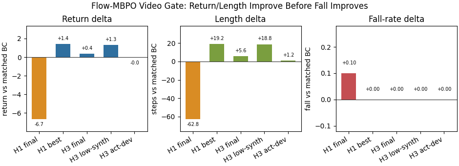
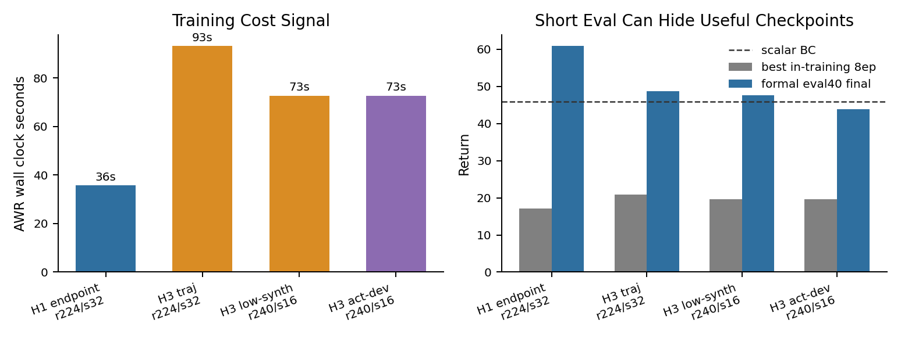
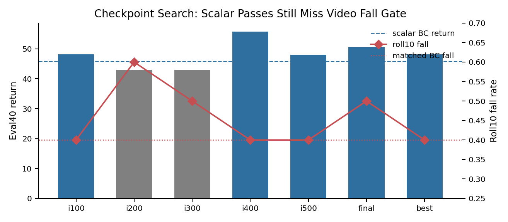
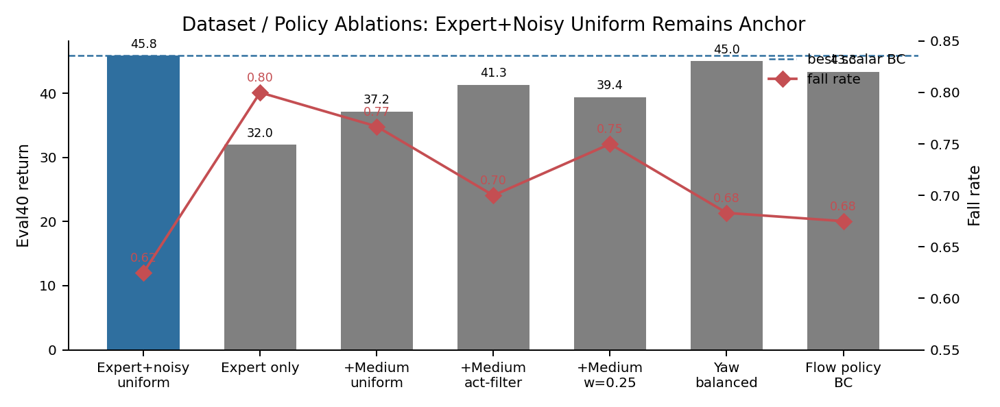
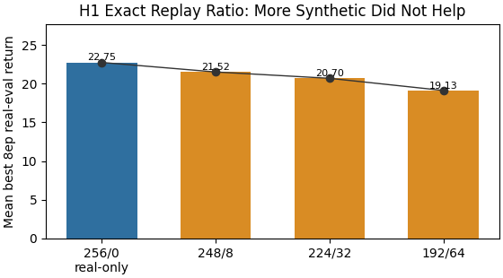
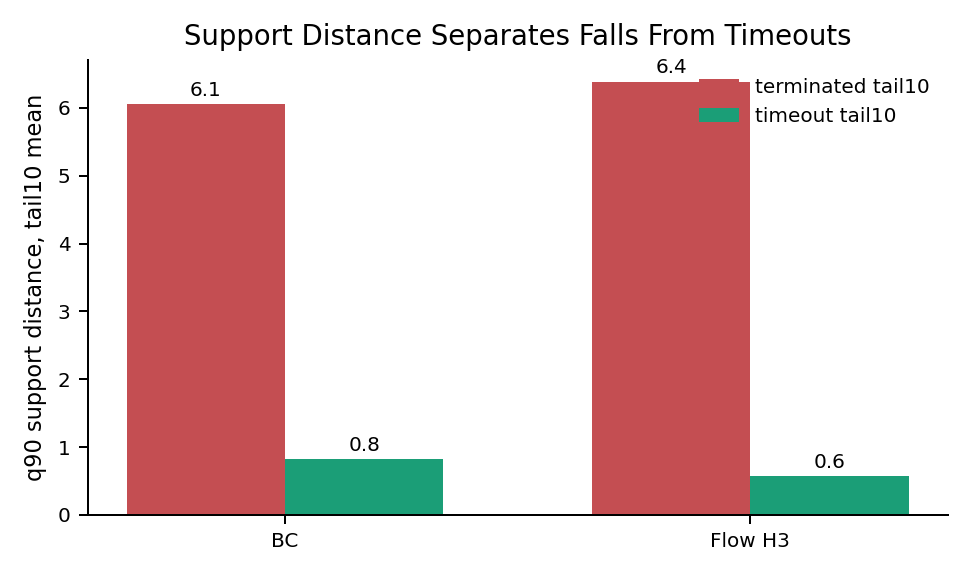

# MJLab QS / Flow-MBPO Progress Report

Generated: 2026-06-11 EDT

Scope: Velocity Flat Unitree G1 MJLab QS, PWM fidelity/adapter work, and the
state-observation Flow-MBPO track. This report is signal-focused: key results
only include rows that change the next research decision. Supporting comparisons
are moved into ablations.

Primary sources:

- `docs/EXPERIMENT_LEDGER.md`
- `results/master_policy_comparison.csv`
- `docs/goals/mjlab_qs_rollout_policy_improvement_20260528.md`
- `docs/goals/flow_mbpo_top_conf_research_plan_20260531.md`
- `docs/git/experiment_results_insights_summary_20260603.md`
- `docs/git/experiment_results_insights_summary_20260604.md`
- `docs/design/flow_mbpo_v0.md`
- `docs/design/flow_mbpo_v1_pessimistic.md`

## Executive Signals

1. **The main positive signal is Flow-MBPO return/length, not fall-rate control.**
   Flow H1 and H3 can beat BC on return/length in selected eval or video gates,
   but current best rows tie or worsen matched BC fall.
2. **PWM-style policy extraction is the wrong main path for MJLab right now.**
   The collapse is downstream of policy/critic exploitation, not just poor
   fixed-window world-model fit.
3. **BC/data changes are mostly not the bottleneck.** Expert+noisy uniform BC is
   still the practical anchor; expert-only, medium mixing, yaw balancing,
   action smoothing, and Flow-policy BC do not clearly improve it.
4. **Synthetic data is only useful if it is pessimistic and support-aware.** In
   H1 follow-ups, adding more synthetic replay did not improve short real eval.
5. **The strongest next direction is calibrated support/OOD/fall-risk
   pessimism.** Support distance separates terminated vs timeout real rollout
   episodes; use it in generation/replay/Q penalties, not only as an actor-side
   regularizer.

## Key Results

Only the most reference-worthy rows are kept here. Everything else belongs in
the ablation sections.

| Row | Protocol | Return | Length | Fall | Signal | Next research implication |
| --- | --- | ---: | ---: | ---: | --- | --- |
| Expert collector | rollout reference | `82.6090` | `1000.00` | `0.000` | Target behavior is far above BC. | Need fall robustness, not small BC tuning. |
| Best scalar BC | eval40, 1000-step | `45.8491` | `594.97` | `0.625` | Minimum credible scalar baseline. | All policy claims must beat this on return/length/fall. |
| Matched BC video | roll10, 1000-step, seed0 | `54.1283` | `688.40` | `0.400` | Harder matched-video gate. | Flow rows that tie `0.400` fall are not wins. |
| PWM-style extraction | representative rollout | about `-1.10` | about `54.67` | `1.000` | Collapse despite BC anchoring. | Stop unconstrained imagined extraction as main path. |
| Flow-MBPO H1 endpoint | final eval40 | `60.8721` | `759.30` | `0.450` | Strongest scalar lift. | Promising, but video/robustness gate remains unresolved. |
| Flow-MBPO H3 trajectory/chunk | final roll10 | `54.4904` | `694.00` | `0.400` | Return/length beat matched BC; fall ties. | Best current direction, but needs fall-risk pessimism. |



## Pipeline Signal

Algorithm: MJLab QS Flow-MBPO Training and Evaluation Pipeline

Input:
    Velocity Flat Unitree G1 MJLab QS data.

    Main dataset:
        - `d_qs_core_h16.pt`
        - mixed QS quality IDs: `expert`, `expert_noisy`, `medium`, `random_smooth`
        - state observation
        - command / task conditioning
        - action
        - reward
        - done / termination / truncation labels -> Current QS shards have effectively no positive done/fall labels, so learned fall heads are not reliable yet.

    Reference policies:
        - expert collector -> Target behavior: high return, full length, zero fall.
        - expert-noisy collector -> Stable noisy target.
        - medium collector -> Data-quality midpoint, not a target.
        - random_smooth -> Failure floor.

Model:
    Baseline policy:
        - MLP BC policy trained from QS windows.
        - Expert+noisy uniform BC is the current practical warm start. -> We use it as the minimum baseline and initialization for Flow-MBPO.

    World model candidates:
        - MLP one-step world model.
        - Flow endpoint world model.
        - Flow residual / frozen-MLP residual variants.
        - Flow trajectory/chunk world model. -> Current strongest research signal comes from short trajectory/chunk replay, not from pure PWM-style architecture replacement.

    Policy update modules:
        - AWR / AWAC-style weighted behavior update.
        - Optional conservative Q critic. -> Current CQL evidence is diagnostic; use it as targeted pessimism, not as a generic extra loss.
        - Optional action-deviation / BC-anchor losses. -> Simple actor-side safeguards did not solve the fall gate.

Training Pipeline:
Step 1: Establish Collector And BC Baselines
    Use existing MJLab collector checkpoints and QS windows. -> We do not recollect the main dataset in the current report.

    Evaluate:
        - expert / expert-noisy / medium / random references
        - BC variants from QS windows

    Result:
        - expert collector is the target.
        - expert+noisy uniform BC is the current scalar baseline.
        - matched seed0 BC roll10 is the video baseline.

Step 2: Diagnose PWM-Style Policy Extraction
    Train or load a learned world model and run PWM-style imagined policy extraction.

    Original idea:
        dataset windows
        -> learned world model
        -> long-horizon imagined actor/critic optimization
        -> extracted policy

    Current finding:
        - fixed-window WM reward/dynamics diagnostics can look reasonable.
        - imagined return / critic value can rise.
        - real MJLab rollout collapses. -> The failure is mainly policy/critic exploitation of unsupported model regions.

Step 3: Generate Short-Horizon Synthetic Replay
    Start from real QS dataset states and roll out a BC-warmstarted policy through a WM ensemble.

    Synthetic rollout settings:
        - H=1 endpoint replay -> Cheap root-cause / ratio diagnostics.
        - H=3 trajectory/chunk replay -> Stronger return/length signal.
        - H=5 and broader variants -> Diagnostic only unless H=3 fall gate improves first.

    Replay stores:
        - state / command / action
        - model reward
        - conservative reward
        - next state
        - done / uncertainty / support-risk metadata

    Modification:
        Original PWM used the model mainly for imagined optimization.
        -> We use the model to generate explicit short synthetic replay, then update the policy with model-free-style losses.

Step 4: Policy Update From BC Warm Start
    Mix real QS transitions and synthetic transitions in AWR/AWAC/CQL-style updates.

    Current useful settings:
        - BC warm start.
        - low synthetic ratios are safer than broad synthetic mixing.
        - final and true-best checkpoints are saved.

    Current negative signals:
        - more H1 synthetic replay did not improve short real eval.
        - action-deviation regularization hurt scalar eval and did not improve video fall.
        - broad conservative/AWAC/support-truncation rows are diagnostic, not wins.

Step 5: Add Pessimism / Support / OOD Control
    Because fall labels are missing, use calibrated support distance as a proxy.

    Current support signal:
        - q90 support distance separates terminated vs timeout real rollout episodes.
        - the signal is mostly state/command OOD, not action OOD.

    Next modification:
        Current support penalties were mostly actor-side or post-hoc.
        -> Move support risk into synthetic rollout generation, replay termination/reward, or conservative Q over generated out-of-support states/actions.

Evaluation Pipeline:
    For every serious candidate:
        1. Save final checkpoint.
        2. Save true-best / snapshot checkpoints when real-eval selection is enabled.
        3. Run 40-episode real MJLab eval at max_steps=1000.
        4. Run 10-episode, 1000-step rollout MP4/W&B video.
        5. Compare against:
            - expert collector
            - expert-noisy collector
            - medium collector
            - best scalar BC
            - matched seed0 BC video

    Claim gate:
        - return must match or exceed the relevant BC baseline.
        - episode length must match or exceed the relevant BC baseline.
        - fall rate must be strictly lower than the relevant BC baseline.
        - W&B run, git SHA, dataset/version, checkpoint paths, command, and notes must be recorded.

    Current outcome:
        Flow-MBPO H1/H3 can improve return and length.
        -> No general policy-improvement claim yet because fall rate has not improved over matched BC.

## Ablations With Signal

### 1. Architecture / Policy Path

Signal:

- PWM-style MLP-vs-Flow architecture swaps collapse under policy extraction;
  they mostly tell us the imagined optimization path is unsafe.
- Flow-policy BC underperforms MLP BC (`43.3222 / 564.46 / fall 0.675` versus
  BC `45.8491 / 594.97 / fall 0.625`), so policy class alone is not the current
  bottleneck.
- Flow-MBPO H1/H3 are much more informative than raw PWM 2x2 rows because they
  test Flow as short-horizon synthetic data, not as an unconstrained simulator.



Interpretation:

- Flow H3 is the better research direction than pure architecture replacement:
  it preserves the return/length signal while exposing the missing fall-control
  problem.
- Future architecture work should compare **support-aware Flow-MBPO vs
  non-Flow MBPO**, not another large PWM-style 2x2.

### 2. Checkpoint Selection / Training-Time Metrics

Signal:

- Short in-training real eval can be badly misaligned with formal eval.
- H1 strongest run had weak in-training real eval (`best_real_return=17.10`) but
  strong final eval40 (`60.87`).
- H3 trajectory/chunk similarly had low in-training best real eval (`20.88`)
  while final eval40 reached `48.73`.
- Candidate snapshot search found scalar-pass checkpoints, but none passed the
  joint scalar+video gate because video fall tied or worsened.





Interpretation:

- Do not use 8-episode in-training eval as the only checkpoint selector.
- Continue saving snapshots, but rank them by the formal gate: eval40 return,
  eval40 fall, roll10 return/length, and roll10 fall.
- If compute is tight, use short eval only as a reject filter, not as proof.

### 3. Compute / Runtime

The available timing is runner wall-clock, not profiler-grade timing. It is
still useful for planning.

| Row | AWR train wall clock | Synthetic transitions | Eval/render note | Signal |
| --- | ---: | ---: | --- | --- |
| H1 endpoint `r224/s32` | `35.8s` | `256` | eval40 final about `59.5s`; roll10 final about `103.7s` | Cheap diagnostic, strongest scalar surprise. |
| H3 trajectory `r224/s32` | `93.2s` | `768` | eval40 final about `55.4s`; roll10 final about `165.9s` | More expensive, better trajectory signal. |
| H3 low-synth `r240/s16` | `72.7s` | `768` | roll10 remains strong | Lower synthetic ratio saves update cost but does not reduce fall. |
| H3 action-deviation | `72.7s` | `768` | scalar eval regresses | Extra safeguard cost is not justified by current evidence. |

Interpretation:

- Use H1 for cheap root-cause tests.
- Use H3 for formal fall-risk experiments only when the pessimism mechanism is
  new and targeted.
- Avoid spending formal W&B/video budget on actor-only regularizers that already
  failed the scalar gate.

### 4. Dataset Composition

Signal:

- Expert+noisy uniform BC remains the best practical BC anchor.
- Expert-only is worse, likely because it lacks recovery/coverage.
- Medium data hurts when mixed naively; filtering/downweighting helps but still
  does not beat expert+noisy.
- Flow policy does not rescue BC.



Interpretation:

- Do not spend the next phase on broad BC micro-sweeps.
- If using medium data again, use it as targeted recovery/fall-boundary data,
  not as uniform BC training data.

### 5. Real/Synthetic Ratio

Signal from the H1 exact replay ratio sweep:

| Real/synthetic batch | Mean best 8ep real eval |
| --- | ---: |
| `256/0` | `22.75` |
| `248/8` | `21.52` |
| `224/32` | `20.70` |
| `192/64` | `19.13` |



Interpretation:

- More synthetic data is not automatically better.
- The synthetic replay needs stronger quality control: support-aware generation,
  conservative reward/Q, and fall-risk termination.
- Synthetic ratio should be tuned only after the synthetic data is visibly safer.

### 6. Support / OOD / Fall-Risk

Signal:

- QS shards have effectively no positive done/fall labels, so direct learned
  done/fall heads are not reliable yet.
- Support distance, however, separates real terminated episodes from timeout
  episodes.
- Action-ablation scoring shows the signal is mostly state/command OOD, not
  actor-action OOD.



Interpretation:

- Actor-only support penalties are too indirect.
- Use support distance where the drift happens: synthetic rollout generation,
  replay termination/reward, and conservative Q over generated states/actions.
- If possible, collect or identify fall-positive / near-fall data to turn this
  proxy into a calibrated fall-risk model.

## Problems & Next Steps

### Current Problems

- Flow-MBPO improves return/length before it improves fall.
- Formal checkpoint selection is noisy; short in-training eval is not enough.
- Synthetic reward artifacts remain plausible: H1 replay diagnostics show
  high-reward synthetic transitions far above nearest real rewards.
- AWR actor movement can be tiny even when formal results differ, so the issue
  is not only large policy drift.
- Done/fall supervision is missing from current QS windows.

### Next Experiments To Prioritize

1. **Support-aware Flow-MBPO generation.** Stop or penalize synthetic branches
   when q90-style support risk rises, then run the same eval40 + roll10 gate.
2. **Conservative Q on generated out-of-support states/actions.** Use CQL as a
   targeted pessimism mechanism, not a generic extra loss.
3. **Matched non-Flow MBPO baseline.** Compare Flow H3 against an MLP MBPO row
   under the same replay/update/gate protocol.
4. **Fall-positive or near-fall data.** Add real failure/recovery coverage so
   fall risk can be learned instead of inferred only from support distance.
5. **Snapshot ranking protocol.** Evaluate promising snapshots formally only
   when they can plausibly clear both scalar and video fall gates.

## Appendix

### Evidence Standard

A policy-improvement claim requires:

- final and true-best checkpoints;
- 40-episode real MJLab eval at `max_steps=1000`;
- 10-episode, 1000-step MP4/W&B rollout;
- return and length at least matching the relevant BC baseline;
- fall rate strictly lower than the relevant BC baseline;
- W&B run, git SHA, dataset/version, checkpoint paths, command, and notes.

### Figure Assets

Generated figures live under:

```text
docs/assets/mjlab_qs_progress_20260611/
```

Files:

- `key_results_ladder.png`
- `flow_video_gate_deltas.png`
- `runtime_and_selection_signal.png`
- `checkpoint_gate_signal.png`
- `dataset_policy_ablation.png`
- `synthetic_ratio_signal.png`
- `support_distance_fall_proxy.png`

### Source Map

| Topic | Source |
| --- | --- |
| Formal MJLab evidence | `docs/EXPERIMENT_LEDGER.md` |
| Compact policy comparison rows | `results/master_policy_comparison.csv` |
| Chronological goal log | `docs/goals/mjlab_qs_rollout_policy_improvement_20260528.md` |
| Pessimistic Flow-MBPO plan | `docs/goals/flow_mbpo_top_conf_research_plan_20260531.md` |
| v0/v1 method design | `docs/design/flow_mbpo_v0.md`, `docs/design/flow_mbpo_v1_pessimistic.md` |
| 2026-06-03/04 result summaries | `docs/git/experiment_results_insights_summary_20260603.md`, `docs/git/experiment_results_insights_summary_20260604.md` |
