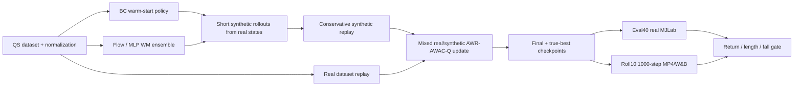
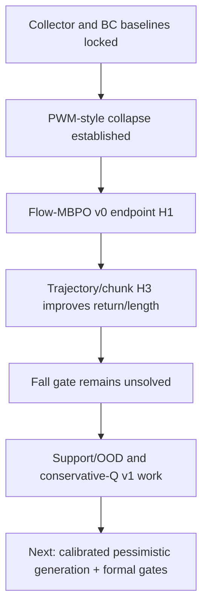

# MJLab QS / Flow-MBPO Progress Report

Generated: 2026-06-11 EDT

Scope: Velocity Flat Unitree G1 MJLab QS, PWM fidelity/adapter work, and the
state-observation Flow-MBPO track. NEWT/LeWorldModel image work is treated as a
side track in this report; it is not the main evidence base.

Primary sources:

- `docs/EXPERIMENT_LEDGER.md`
- `results/master_policy_comparison.csv`
- `docs/goals/mjlab_qs_rollout_policy_improvement_20260528.md`
- `docs/goals/mjlab_qs_flow_mbpo_high_value_next_goal_20260529.md`
- `docs/goals/flow_mbpo_top_conf_research_plan_20260531.md`
- `docs/goals/pwm_fidelity_mjlab_flow_migration_20260601.md`
- `docs/goals/pwm_flow_sigreg_image_research_plan_20260602.md`
- `docs/design/flow_mbpo_v0.md`
- `docs/design/flow_mbpo_v1_pessimistic.md`
- `docs/git/experiment_results_insights_summary_20260603.md`
- `docs/git/experiment_results_insights_summary_20260604.md`

Important caveat: only real MJLab eval and rollout/video evidence should be
treated as policy evidence. World-model loss, imagined return, W&B-disabled
smokes, and one-off diagnostics are useful for debugging but are not sufficient
for a policy-improvement claim.

## Conclusion & Insights

The current project should be described as a rollout-first MJLab policy
improvement study, not as a generic architecture swap. The clean research arc is:

```text
MJLab QS collector/reference baselines
-> BC warm-start and evaluation protocol
-> PWM-style policy-extraction collapse
-> short-horizon Flow-MBPO candidate results
-> pessimistic/support/OOD/fall-risk debugging
```

Current high-level conclusions:

1. **Expert and expert-noisy collectors are the real target.** Expert return is
   `82.6090` with length `1000.00` and fall `0.000`; expert-noisy is similarly
   stable at `80.3525 / 1000.00 / 0.000`.
2. **The strongest practical scalar BC baseline is much lower and still falls
   often.** Expert+noisy uniform BC reaches `45.8491 / 594.97 / fall 0.625` in
   40-episode, 1000-step real eval. Matched seed0 BC roll10 is stronger on the
   video gate: `54.1283 / 688.40 / fall 0.400`.
3. **PWM-style imagined policy extraction collapses on MJLab.** The failure is
   not explained by a basic fixed-window world-model fit failure. Diagnostics
   show reasonable reward/dynamics fit on QS windows, but policy extraction and
   critic/value optimization push the actor into out-of-distribution regions,
   high action drift/saturation, and over-optimistic imagined values.
4. **Flow-MBPO has the strongest positive signal so far, but it is not yet a
   claimable policy improvement.** H1 endpoint and trajectory/chunk H3 variants
   can improve return and episode length over BC in some scalar/video views, but
   the strict gate requires return and length to improve while fall rate
   decreases. Current best Flow-MBPO rows usually tie or worsen the matched BC
   fall rate.
5. **The next bottleneck is fall/support/OOD control, not another broad BC or
   architecture sweep.** Existing QS shards have effectively no positive
   done/fall labels, so learned done/fall heads are not reliable safety signals
   without additional data or proxy calibration. Support distance is a more
   useful current proxy because it separates terminated and timeout episodes in
   real rollout logs.

The most conservative headline is:

> Flow-MBPO is promising on return and length, but no general MJLab policy
> improvement claim is justified until final and true-best checkpoints clear
> the 40-episode eval and matched roll10 video gates with lower fall rate than
> BC.

## Key Results

### Claim Gate Used In This Report

For a method to be promoted from "promising" to "policy improvement", it must
clear all of:

- final and true-best actor checkpoints exist;
- 40-episode real MJLab eval at `max_steps=1000`;
- 10-episode, 1000-step rollout MP4/W&B video;
- return at least matches or exceeds the relevant BC baseline;
- episode length at least matches or exceeds the relevant BC baseline;
- fall rate is strictly lower than the relevant BC baseline;
- W&B run, git SHA, dataset/version, checkpoints, command, and notes are logged.

### Main Evidence Table

| Row | Protocol | Return | Length | Fall | Status | Interpretation |
| --- | --- | ---: | ---: | ---: | --- | --- |
| Expert collector | rollout reference | `82.6090` | `1000.00` | `0.000` | target | Stable upper target for current QS setup. |
| Expert-noisy collector | rollout reference | `80.3525` | `1000.00` | `0.000` | target | Noisy target remains stable. |
| Medium collector | rollout reference | `49.1935` | `653.33` | `0.667` | reference | Useful data-quality midpoint, not a target. |
| Random smooth | rollout reference | `0.4857` | `75.33` | `1.000` | lower reference | Confirms failure floor. |
| Expert+noisy uniform BC | eval40, 1000-step | `45.8491` | `594.97` | `0.625` | scalar BC baseline | Best current aggregate scalar BC baseline. |
| Matched BC seed0 final | roll10, 1000-step | `54.1283` | `688.40` | `0.400` | matched video baseline | Main matched-video comparator for seed0 Flow-MBPO rows. |
| Expert-only BC | eval40, 1000-step | `31.9514` | `426.94` | `0.800` | negative BC ablation | Expert-only data hurts robustness versus expert+noisy. |
| Flow-policy BC | eval40, 1000-step | `43.3222` | `564.46` | `0.675` | negative policy ablation | Flow policy class alone does not beat MLP BC. |
| BC-warm PWM representative | rollout | about `-1.10` | about `54.67` | `1.000` | collapse | Stronger anchoring still does not preserve BC behavior. |
| Full upstream PWM on MJLab | eval40/roll10 | about `-1.7` | about `40-53` | `1.000` | collapse | Faithful upstream path is mechanically feasible but collapses in real eval. |
| Flow-MBPO H1 endpoint final | eval40 | `60.8721` | `759.30` | `0.450` | promising, not claimable | Strongest scalar lift over BC, but matched video gate is weaker. |
| Flow-MBPO H1 endpoint best | roll10 | `55.5533` | `707.60` | `0.400` | promising, not claimable | Slightly beats matched BC return/length and ties fall; tie is not enough. |
| Flow trajectory/chunk H3 final | eval40 | `48.7296` | `637.225` | `0.575` | promising, not claimable | Clears aggregate BC return/length and fall in scalar eval, but video fall only ties matched BC. |
| Flow trajectory/chunk H3 final | roll10 | `54.4904` | `694.00` | `0.400` | promising, not claimable | Improves matched BC return/length but ties fall. |
| Flow trajectory/chunk H3 low-synth final | roll10 | `55.4222` | `707.20` | `0.400` | promising, not claimable | Lower synthetic ratio preserves video return/length gains but still ties fall. |
| Action-deviation Flow-MBPO H3 | eval40 | `43.9079` | `577.45` | `0.725` | negative safeguard | Safeguard is mechanically clean but hurts scalar eval and does not improve video fall. |

### What Counts As A Reliable Result

The key results above are selected because they are tied to real MJLab eval,
rollout/video gates, or formal evidence records. Most W&B-disabled smokes and
short diagnostics should stay in the appendix because they verify plumbing or
failure mechanisms rather than policy quality.

## Pipeline (w/ Diff)

### Original PWM-Style Path We Tested


Important observed failure:

- Fixed-window reward/dynamics diagnostics can look reasonable.
- Imagined return and critic values can rise sharply.
- Extracted policies still collapse in real MJLab rollout.
- Therefore the core failure is policy/critic exploitation of the learned model,
  not only basic one-step model loss.

### Current Flow-MBPO Path



Main differences from the failed PWM-style path:

| Area | Earlier PWM-style path | Current Flow-MBPO direction |
| --- | --- | --- |
| Rollout horizon | Long imagined optimization through learned model | Short synthetic rollouts from real dataset states, typically `H=1/3/5` |
| Policy starting point | Extracted policy can drift from data | Start from strongest BC checkpoint |
| Policy update | Imagined-gradient actor/critic extraction | Model-free-style AWR/AWAC/conservative-Q on mixed real/synthetic data |
| Synthetic data | Used implicitly through imagined optimization | Explicit replay buffer with provenance and conservative rewards |
| Safety signal | Model done/fall or imagined value can be trusted too much | Uncertainty, support/OOD distance, fall-risk proxies, early termination |
| Selection | Imagined return or short in-training eval can mislead | Save final and real-eval true-best checkpoints |
| Claim standard | Often diagnostic in older rows | Eval40 + roll10 video + return/length/fall gate |

### Current Evidence Flow



## Ablations & Insights

### 1. BC And Dataset Ablations

The BC baseline work was useful because it established a real floor and exposed
evaluation pitfalls.

| Ablation | Result | Insight |
| --- | --- | --- |
| Expert+noisy uniform BC | `45.8491 / 594.97 / fall 0.625` in eval40 | Current scalar BC anchor. |
| 300-step videos vs 1000-step eval/render | 300-step videos understated BC return/length | Horizon must be explicit in every report. |
| Expert-only BC | `31.9514 / 426.94 / fall 0.800` | Expert-only data is less robust than expert+noisy. |
| Action-rate smoothness | Smooth best can slightly improve return but fall remains high | Smoothness is not a reliable fix. |
| Yaw-balanced sampling | `44.9913 / 585.48 / fall 0.683` | Does not beat uniform expert+noisy BC. |
| Naive medium mixing | `37.1504 / 489.88 / fall 0.767` | Medium data hurts when mixed plainly. |
| Medium action-norm filtering / downweighting | Improves naive medium but remains below BC | Medium needs targeted recovery use, not plain BC mixing. |
| Flow policy BC | `43.3222 / 564.46 / fall 0.675` | Flow policy class alone is not the BC bottleneck. |

Decision: stop broad BC micro-sweeps unless a new diagnosis directly requires
one. Use expert+noisy uniform BC as the default warm start and minimum baseline.

### 2. PWM Collapse Diagnostics

PWM-style extraction is not failing merely because the world model cannot fit
the logged QS windows.

Observed diagnostics:

- WM reward correlation is around `0.962-0.966`.
- WM reward MSE is around `0.069-0.083`.
- H16 dynamics MSE is around `0.0031-0.0032`.
- Dataset predicted return remains near the logged data regime.
- Extracted policy predicted return rises to about `28.5-28.7`.
- Extracted policy action saturation is about `33.5%`.
- Extracted policy vs dataset action MSE is about `0.71-0.72`.
- Critic value mean after extraction is about `163`.

Interpretation:

The learned model is sufficiently accurate on fixed QS windows to pass basic
fit diagnostics, but the actor/critic update exploits unsupported regions. This
is why imagined return alone is not a valid progress metric.

### 3. Flow-MBPO Candidate Ablations

Flow-MBPO is better framed as conservative short-horizon model-based data
augmentation than as a drop-in PWM dynamics replacement.

| Candidate | Result | Interpretation |
| --- | --- | --- |
| H1 endpoint, final eval40 | `60.8721 / 759.30 / fall 0.450` | Strongest scalar improvement, but not enough because video gate is weaker and robustness remains unresolved. |
| H1 endpoint, true-best roll10 | `55.5533 / 707.60 / fall 0.400` | Beats matched BC return/length and ties fall; strict gate requires fall improvement. |
| H3 trajectory/chunk, final eval40 | `48.7296 / 637.225 / fall 0.575` | More modest scalar lift, still promising. |
| H3 trajectory/chunk, final roll10 | `54.4904 / 694.00 / fall 0.400` | Return/length improve versus matched BC, fall ties. |
| H3 lower synthetic ratio, final roll10 | `55.4222 / 707.20 / fall 0.400` | Lower synthetic ratio preserves return/length gains but does not reduce fall. |
| H3 action-deviation safeguard | eval40 `43.9079 / 577.45 / fall 0.725` | Simple action-deviation regularization is not sufficient. |

Decision: do not expand these exact candidates to more seeds as policy wins.
They are strong enough to justify pessimism/support/OOD work, but not strong
enough for a performance claim.

### 4. Support / OOD / Fall-Risk Ablations

Support distance is currently the most useful fall-risk proxy because existing
QS shards lack positive done/fall labels.

Key observations:

- The current QS raw shards have zero positive `done`, `termination`, and
  `truncation` labels across random_smooth, medium, expert, and expert_noisy.
- Class-balanced done loss or larger done-loss weight cannot calibrate a fall
  head without positive labels.
- Real rollout support-feature logging shows q90 support distance separates
  terminated episodes from timeout episodes.
- In matched BC/Flow rollouts, terminated episodes have large final support
  spikes while timeout episodes stay much closer to support.
- Action-ablation scoring shows the separation is mainly state/command OOD,
  not action OOD.

Representative calibration:

| Policy | Episode type | q90 support max mean | q90 support tail10 mean | Interpretation |
| --- | --- | ---: | ---: | --- |
| BC seed0 final | terminated | `11.7936` | `6.0608` | Large late support spikes before failures. |
| BC seed0 final | timeout | `1.7309` | `0.8289` | Successful episodes remain much closer to support. |
| Flow H3 lowsynth final | terminated | `12.8382` | `6.3886` | Failure pattern persists under Flow. |
| Flow H3 lowsynth final | timeout | `1.4489` | `0.5694` | Timeout episodes remain close to support. |

Decision:

- Raw q50 support penalties are too broad.
- q90-style support risk is more plausible.
- Actor-only support penalties do not target the failure well because the risk
  is dominated by state/command drift.
- Next useful variants should apply support risk during generation,
  conservative reward, early termination, or conservative Q over generated
  out-of-support states/actions.

### 5. Negative And Deprioritized Directions

These should stay in the report as lessons, not as candidates:

- Further unconstrained PWM extraction.
- More BC yaw/smoothness/medium-mixing micro-sweeps without a new diagnosis.
- Treating one-step WM MSE as a method ranking.
- Broad conservative AWR/AWAC/support-truncation rows that still fall at rate
  `1.000` or fail the BC gate.
- Claiming improvement from roll10 if eval40 collapses, or from eval40 if
  matched video fall is not improved.
- Image/NEWT/LeWorldModel performance claims without matched official baselines
  and eval/video gates.

## Problems & Next Steps

### Current Problems

1. **BC still falls too often.** Even the best scalar BC baseline has fall
   `0.625`, so preserving BC is not enough for the final research goal.
2. **Flow-MBPO improves return/length more reliably than fall.** The best rows
   often tie matched BC fall instead of reducing it.
3. **Checkpoint selection is fragile.** Historical H1 evidence shows that
   in-training short eval can underrate a checkpoint that later looks strong in
   eval40, while other rows show the opposite. Final and true-best checkpoints
   both need formal evaluation.
4. **Done/fall labels are missing in QS data.** This blocks direct learned
   fall-head calibration unless additional fall-positive data or proxies are
   introduced.
5. **Support risk is mostly state/command driven.** Actor-only penalties miss
   much of the real failure distribution.
6. **Some historical results are positive but not robust.** The H1 `60.8721`
   result is reproducible as a scalar checkpoint result, but robustness across
   eval seeds and AWR seeds remains unresolved.

### Recommended Next Steps

1. **Make the formal gate non-negotiable.** Every serious candidate should
   produce final and true-best eval40 plus matched roll10 MP4/W&B videos with
   baseline gate metadata.
2. **Prioritize calibrated support-risk generation.** Apply support distance
   during synthetic rollout generation or replay preparation, not only as a
   weak actor-side loss.
3. **Use conservative Q only as a targeted pessimism tool.** The temp `0.5`
   CQL smoke is useful diagnostically, but it is not a formal candidate because
   short real eval collapsed and video only tied BC fall.
4. **Treat faithful PWM and one-variable Flow replacements as causal isolation.**
   They are valuable for explaining whether the failure is PWM fidelity,
   MJLab transfer, or Flow-specific behavior, but the main improvement path is
   pessimistic short-horizon Flow-MBPO.
5. **Collect or identify fall-positive / near-fall data if possible.** Without
   positive fall labels, support/OOD proxies can help but direct fall-risk
   learning remains limited.
6. **Keep image/NEWT/LeWM as a side track until state-based claims are clean.**
   Setup and smokes are fine, but performance claims require matched official
   baselines and the same evidence discipline.

## Appendix

### Source Map

| Topic | Primary source |
| --- | --- |
| Formal MJLab evidence ledger | `docs/EXPERIMENT_LEDGER.md` |
| Collector/BC/PWM summary rows | `results/master_policy_comparison.csv` |
| Chronological BC and Flow-MBPO goal log | `docs/goals/mjlab_qs_rollout_policy_improvement_20260528.md` |
| High-value Flow-MBPO objective | `docs/goals/mjlab_qs_flow_mbpo_high_value_next_goal_20260529.md` |
| Pessimistic Flow-MBPO research plan | `docs/goals/flow_mbpo_top_conf_research_plan_20260531.md` |
| Flow-MBPO v0 design | `docs/design/flow_mbpo_v0.md` |
| Flow-MBPO v1 pessimistic design | `docs/design/flow_mbpo_v1_pessimistic.md` |
| PWM fidelity and MJLab transfer plan | `docs/goals/pwm_fidelity_mjlab_flow_migration_20260601.md` |
| PWM/Flow/SIGReg/image broader plan | `docs/goals/pwm_flow_sigreg_image_research_plan_20260602.md` |
| 2026-06-03 evidence summary | `docs/git/experiment_results_insights_summary_20260603.md` |
| 2026-06-04 H1/root-cause update | `docs/git/experiment_results_insights_summary_20260604.md` |

### Useful W&B Projects / Run Groups

Use W&B for artifact lookup, not as a substitute for the tracked evidence
tables.

| Evidence family | W&B / local pointer |
| --- | --- |
| Collector baselines | `flow-mbpo-mjlab-collector-baselines-20260528` |
| BC eval40 long1000 | `flow-mbpo-mjlab-bc-eval40-long1000-20260528` |
| Flow-MBPO v0 endpoint/H1 | local dirs under `scripts/outputs/mjlab_qs/flow_mbpo_v0_*` |
| Flow-MBPO trajectory/chunk H3 | local dirs under `scripts/outputs/mjlab_qs/flow_mbpo_v0_eval/`, `flow_mbpo_v0_rollouts/`, and `flow_mbpo_v1_*` |
| Support/OOD diagnostics | support-feature and scoring outputs under `scripts/outputs/mjlab_qs/flow_mbpo_v1_*` |

### Suggested Figures For A Slide Version

The Markdown report intentionally avoids generated image assets. For a slide or
paper-style progress update, generate these later:

1. Baseline ladder: random, BC, medium, Flow-MBPO H3/H1, expert-noisy, expert.
2. Claim-gate matrix: scalar eval pass, video pass, fall improved, claimable.
3. Pipeline diff: PWM imagined extraction vs Flow-MBPO short synthetic replay.
4. Support-risk plot: tail support distance for terminated vs timeout episodes.
5. Experiment map: BC/debugging, PWM fidelity, Flow-MBPO v0, pessimistic v1,
   side-track image work.

### Report Positioning

This document is meant to be a high-level progress report. It intentionally
does not replace the experiment ledger or goal logs. If a future row clears the
strict gate, update this report by adding a new key-result row and changing the
conclusion from "promising but not claimable" to the specific, bounded claim
that the matched evidence supports.
